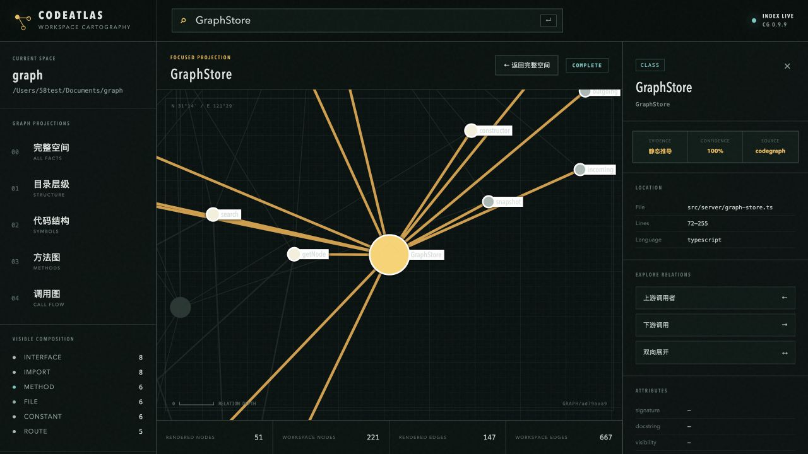

# CodeAtlas

CodeAtlas 是一个面向人和 AI 的本地代码知识空间。



它在指定工作空间中生成完整代码图谱，并以全景图、目录图、代码结构图、方法图、调用图等不同视图呈现同一份底层知识。用户可以从任意节点切入，探索、验证并持续积累项目知识；AI 则通过 MCP 使用同一份图谱、视角和人工知识。

## 产品原则

> 一个工作空间，一份完整底层图谱，多种关系图层和观察视图。

- 完整空间图是最终事实视图，不因复杂而被隐藏。
- 大图采用全量数据、分级渲染和语义缩放，不通过静默裁剪换取可读性。
- 用户决定从哪个节点、路径或业务问题切入。
- 代码事实、推导关系、AI 推断和人工知识必须标明来源与可信度。
- 本地优先，源代码和项目图谱默认不离开设备。

## 预期使用方式

```bash
codeatlas init
codeatlas init /path/to/workspace
codeatlas open
```

`codeatlas init` 将当前目录或指定目录定义为工作空间，创建 `.codeatlas/`，检测或调用 CodeGraph 生成代码事实图谱。`codeatlas open` 启动仅监听本机回环地址的 Web 可视化界面。

## 第一版范围

- 完整空间图
- 目录层级图
- 代码结构图与方法图
- 调用图、上下游展开和两点路径查找
- 节点详情、源码定位、来源与可信度说明
- 保存视角、链路和人工知识标注
- 多项目工作空间
- CodeGraph 适配器

数据库关系、OpenAPI、运行时 Trace 和完整数据链路分析属于后续数据源与分析能力。

## 文档

- [产品与系统设计](docs/plans/2026-08-04-codeatlas-design.md)
- [架构决策记录](docs/adr/README.md)

## 开发预览

当前纵向切片已经可以运行：

```bash
npm install
npm run build
node dist/cli.js init /path/to/workspace
node dist/cli.js open /path/to/workspace
```

浏览器界面支持完整空间、目录、代码结构、方法和调用视图，以及搜索、节点证据和上下游聚焦。

验证命令：

```bash
npm run typecheck
npm test
npm run test:e2e
```

当前仍属于 MVP 纵向切片。保存视角、人工知识、MCP、数据库关系图和完整数据链路图尚未实现。
