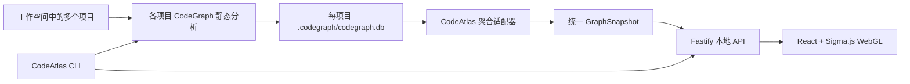

# CodeAtlas

> 面向开发者的本地代码图谱浏览器：将代码结构与调用关系转换为可搜索、可聚焦、可验证的交互式图谱。

**当前版本：`v0.3.0` · 发布阶段：Beta / pre-release · 更新日期：2026-08-05**

CodeAtlas 基于 [CodeGraph](https://github.com/colbymchenry/codegraph) 生成的静态分析结果，为代码仓库提供完整空间图、目录层级图、代码结构图、方法图和调用图。它适合用来理解陌生项目、追踪上下游调用、核对关系来源，以及从复杂代码库中快速找到切入点。

CodeAtlas 默认在本机运行。源代码、索引数据库和图谱数据不会因为使用 CodeAtlas 而自动上传到远程服务。

> [!IMPORTANT]
> 当前版本为 `0.3.0` Beta，新增 Java/Spring/MyBatis 表级数据链路，以及基于 Maven 契约证据的 Java 跨项目调用。MCP、知识标注、更多语言 Provider、字段级数据流和运行时 Trace 仍在规划中。


## 版本信息

| 项目 | 版本或状态 |
|---|---|
| CodeAtlas | `0.3.0` |
| 发布阶段 | Beta / pre-release |
| 工作空间配置 Schema | `2`（自动迁移 Schema 1） |
| Node.js | `>= 22.5.0` |
| 已验证 CodeGraph 版本 | `0.9.9` |

CodeAtlas 遵循[语义化版本](https://semver.org/lang/zh-CN/)。`0.x` 阶段仍可能出现不向后兼容的配置、CLI 或图谱模型变更；升级前请查看 [CHANGELOG.md](CHANGELOG.md)。项目版本以 `package.json` 为唯一事实来源，`codeatlas --version` 应与其保持一致。

## 核心能力

- **统一代码图谱**：目录、文件、类型、方法和关系来自同一份底层图谱，而不是彼此独立的数据视图。
- **多项目聚合**：一个工作空间可注册多个项目，并安全聚合彼此独立的 CodeGraph 索引。
- **项目范围切换**：在全部项目和单个项目之间切换；图谱、计数和搜索同步遵循当前范围。
- **跨项目依赖与调用**：根据 `package.json` 生成项目依赖；对 Maven + Java 使用依赖坐标、接口类型和方法签名生成可验证的 `REMOTE_CALLS`。
- **多视图投影**：支持完整空间、目录层级、代码结构、方法、调用关系和数据链路视图。
- **节点搜索与聚焦**：搜索文件或符号，从任意节点展开上游、下游或双向关系。
- **明确的调用方向**：箭头指向关系目标；入向关系使用青色，出向关系使用琥珀色。
- **复杂图视觉隔离**：选中节点后隐藏无关节点和关系，避免背景元素遮挡当前链路。
- **悬停证据卡**：展示所属作用域、可见性、方法签名、参数、注释、源码位置和可信度。
- **关系可验证**：节点和关系携带数据来源、证据类型与置信度，不把推断伪装成确定事实。
- **本地优先**：Web 服务只监听 `127.0.0.1`，接口使用随机会话令牌保护。

## 功能状态

| 能力 | 状态 | 说明 |
|---|---|---|
| 工作空间初始化、状态检查与同步 | 已实现 | `init`、`status`、`sync` |
| CodeGraph SQLite 适配 | 已实现 | 读取文件、符号和关系数据 |
| 完整空间与多种图谱视图 | 已实现 | 完整、目录、结构、方法、调用 |
| 搜索、节点详情与上下游聚焦 | 已实现 | 支持入向、出向和双向展开 |
| 方向箭头、视觉隔离与悬停证据卡 | 已实现 | 面向复杂关系图的可读性增强 |
| 多项目工作空间聚合 | 已实现 | 独立索引、统一命名空间、项目切换与范围搜索 |
| 包级跨项目依赖 | 已实现 | JavaScript/TypeScript `package.json` 的明确依赖 |
| Java 跨项目契约调用 | 已实现 | Maven 依赖 + 完整限定接口 + 方法参数个数唯一匹配 |
| Java/MyBatis 数据链路 | 已实现 | Route、调用、Mapper、XML SQL 与 Table 的静态链路 |
| 保存视角、链路与人工知识 | 规划中 | 数据模型已设计，尚未实现持久化 |
| MCP 服务 | 规划中 | 未来让 AI 使用同一份图谱与知识 |
| Schema、字段级数据流与运行时 Trace | 规划中 | 当前已交付表级静态数据链路 |

## 环境要求

- macOS、Linux 或 Windows
- Node.js `>= 22.5.0`
- npm
- CodeGraph CLI

安装 CodeGraph：

```bash
npm install --global @colbymchenry/codegraph
codegraph --version
```

CodeAtlas 当前通过 CodeGraph 的本地 SQLite 索引读取代码事实，因此运行前必须确保 `codegraph` 命令可用。

## 安装

CodeAtlas 尚未发布到 npm，需要从源码安装：

```bash
git clone git@github.com:hanfeng529264/codeatlas.git
cd codeatlas

npm ci
npm run build
npm link
```

验证 CLI：

```bash
codeatlas --version
codeatlas --help
```

`npm link` 只需执行一次。后续拉取代码后重新运行 `npm run build` 即可更新本机命令。

## 快速开始

普通使用只需要一个命令：

```bash
codeatlas open /absolute/path/to/project
```

CodeAtlas 会自动：

1. 初始化工作空间。
2. 识别单项目或 `projects/` 多项目结构。
3. 注册发现的项目并建立缺少的 CodeGraph 索引。
4. 端口占用时自动选择可用端口。
5. 启动本地服务并打开图谱。

`open` 和 `init` 都可以安全重复执行。已有配置不会被覆盖，已注册项目不会重复添加。

只想准备索引、暂时不打开页面时：

```bash
codeatlas init /absolute/path/to/project
```

检查状态：

```bash
codeatlas status /absolute/path/to/project
```

输出示例：

```text
Workspace  example-project
Root       /absolute/path/to/project
Projects   1 · 1 indexed
CodeGraph  all indexed · v0.9.9
Graph      12,480 nodes · 31,026 edges
```

需要机器可读结果时：

```bash
codeatlas status /absolute/path/to/project --json
```

CodeAtlas 会启动本地 Web 服务并打开浏览器。终端需要保持运行；按 `Ctrl+C` 停止服务。

默认端口为 `43117`；被占用时 CodeAtlas 会自动选择可用端口。需要固定端口时也可以显式指定：

```bash
codeatlas open /absolute/path/to/project --port 43118
```

同步代码变化：

```bash
codeatlas sync /absolute/path/to/project
```

需要强制完整重建 CodeGraph 索引时：

```bash
codegraph index --force /absolute/path/to/project
```

## CLI 参考

| 命令 | 用途 | 常用选项 |
|---|---|---|
| `codeatlas init [path]` | 初始化、发现项目并建立 CodeGraph 索引 | `--empty`、`--skip-codegraph`、`--no-discover` |
| `codeatlas project add <path>` | 注册并索引工作空间内的项目 | `--workspace`、`--name`、`--skip-codegraph` |
| `codeatlas project scan [directory]` | 自动发现、注册并索引一级子项目 | `--workspace`、`--skip-codegraph` |
| `codeatlas project list [path]` | 列出工作空间项目 | `--json` |
| `codeatlas project remove <id>` | 从工作空间取消注册，不删除代码或索引 | `--workspace` |
| `codeatlas status [path]` | 查看工作空间与图谱健康状态 | `--json` |
| `codeatlas sync [path]` | 增量同步代码变化 | — |
| `codeatlas open [path]` | 自动初始化、发现、索引并打开图谱 | `--port`、`--no-browser`、`--no-discover` |

CLI 会从给定路径（省略时为当前目录）向上寻找最近的 `.codeatlas/workspace.json`。

## 图谱交互

### 视图

| 视图 | 主要内容 | 适用场景 |
|---|---|---|
| 完整空间 | 当前索引中的全部节点和关系 | 观察整体规模、中心节点与耦合情况 |
| 目录层级 | Workspace、Project、Directory、File | 理解项目结构和目录边界 |
| 代码结构 | 文件、类型、导入、继承与实现 | 查看静态代码组织方式 |
| 方法图 | 类、接口、函数和方法 | 从符号层理解代码职责 |
| 调用图 | CALLS 等执行关系 | 追踪调用者和被调用者 |
| 数据链路 | ROUTES_TO、CALLS、REMOTE_CALLS、READS_FROM、WRITES_TO、MAPS_TO | 从接口追踪到数据库表，或从表反查入口 |

### 方向约定

```text
调用者 ─────────→ 当前节点 ─────────→ 被调用者
       青色 / IN           琥珀色 / OUT
```

- 箭头始终指向关系目标。
- 选中节点后，只保留当前节点、直接上下游节点及其关系。
- 取消选择后恢复完整图谱。
- 鼠标悬停节点可查看证据卡，不会改变当前选中的链路。

## 多项目工作空间

多项目也只需要执行 `open`。当共同父目录下存在 `projects/` 时会自动识别：

```bash
codeatlas open /workspace/team
```

`init`、`project scan/add/list/remove` 保留给需要预先建索引或精确控制注册范围的用户。

当工作空间存在 `/workspace/team/projects/` 时，`scan` 默认扫描该目录；否则扫描工作空间根目录。也可以指定其他内部目录：

```bash
codeatlas project scan ./services --workspace /workspace/team
```

扫描只识别一级子目录，并根据 `.git`、`pom.xml`、`package.json`、Gradle、Go、Rust、Python 清单或常见源码目录判断项目。隐藏目录、依赖和构建输出会被忽略，已经注册的项目会安全跳过。

需要精确控制单个项目的名称时，仍可使用：

```bash
codeatlas project add /workspace/team/frontend --workspace /workspace/team --name Frontend
```

每个项目继续持有自己的 `.codegraph/codegraph.db`；CodeAtlas 在读取时为节点 ID 加上项目命名空间并聚合结果，因此不同项目中的同名文件或符号不会冲突。Web 左侧的 **PROJECT SCOPE** 可切换全部项目或单个项目，搜索也会遵循当前范围。

取消注册不会删除项目文件或 CodeGraph 索引：

```bash
codeatlas project remove api --workspace /workspace/team
```

项目必须位于工作空间根目录内部。JavaScript/TypeScript 项目可通过匹配的 `package.json` 生成项目级依赖；Java/Maven 项目只有在依赖坐标、完整限定接口、方法名和参数个数均能唯一匹配时才生成 `REMOTE_CALLS`。候选不唯一时 CodeAtlas 会跳过并报告诊断，不会把同名方法猜测成确定事实。

## 架构



主要技术选择：

- **CLI 与服务端**：TypeScript、Commander、Fastify
- **图谱数据**：CodeGraph SQLite、Node.js SQLite API
- **前端**：React、Sigma.js、Graphology、ForceAtlas2
- **构建与测试**：Vite、Vitest、Playwright

详细决策见 [架构决策记录](docs/adr/README.md)。

## 项目结构

```text
codeatlas/
├── src/
│   ├── adapters/       # CodeGraph 数据适配
│   ├── core/           # 工作空间和统一类型
│   ├── server/         # 本地 API 与图谱查询
│   └── cli.ts          # CLI 入口
├── web/
│   ├── graph/          # Sigma 图谱渲染与交互
│   ├── App.tsx
│   └── styles.css
├── tests/              # 单元、集成与端到端测试
├── docs/
│   ├── adr/            # 架构决策记录
│   └── plans/          # 产品和实施设计
└── package.json
```

## 本地开发

```bash
npm ci

# 完整构建
npm run build

# 仅启动前端开发服务器
npm run dev

# 类型检查
npm run typecheck

# 单元与集成测试
npm test

# 端到端测试
npm run test:e2e
```

直接运行尚未链接的 CLI：

```bash
node dist/cli.js init /absolute/path/to/project
node dist/cli.js open /absolute/path/to/project
```

## 本地数据与版本控制

CodeAtlas 和 CodeGraph 会在被分析项目中创建本地数据目录。建议加入项目的 `.gitignore`：

```gitignore
.codeatlas/
.codegraph/
```

Web 服务仅绑定本机回环地址，并为每次启动生成随机访问令牌。不要把带有令牌的本地 URL 发布到日志、Issue 或公共聊天中。

## 路线图

- [x] 多项目索引、项目切换与包级跨项目关系
- [x] Java/Maven 跨项目契约调用与 Java/MyBatis 表级数据链路
- [ ] 保存视角、链路和人工知识标注
- [ ] 面向 AI 客户端的 CodeAtlas MCP 服务
- [ ] 更多语言/ORM、Schema、OpenAPI 和 GraphQL 关系图
- [ ] 字段级静态数据流与运行时 Trace 融合
- [ ] 大规模图谱的语义缩放、聚合和增量布局
- [ ] 安装包、版本发布与升级机制

路线图描述目标，不代表已经交付。具体设计见 [产品与系统设计](docs/plans/2026-08-04-codeatlas-design.md)。

## 贡献

欢迎通过 Issue 报告问题或讨论设计，也欢迎提交 Pull Request。提交前请至少运行：

```bash
npm run typecheck
npm test
npm run build
```

涉及架构方向变化时，请新增 ADR，而不是直接改写已经接受的历史决策。

## 许可证

CodeAtlas 使用 [Apache License 2.0](./LICENSE) 开源。你可以在遵守许可证条款的前提下使用、修改和分发本项目。
