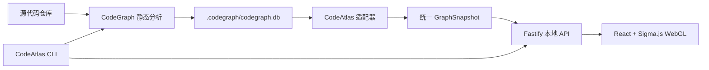

# CodeAtlas

> 面向开发者的本地代码图谱浏览器：将代码结构与调用关系转换为可搜索、可聚焦、可验证的交互式图谱。

**当前版本：`v0.1.0` · 发布阶段：MVP · 更新日期：2026-08-04**

CodeAtlas 基于 [CodeGraph](https://github.com/colbymchenry/codegraph) 生成的静态分析结果，为代码仓库提供完整空间图、目录层级图、代码结构图、方法图和调用图。它适合用来理解陌生项目、追踪上下游调用、核对关系来源，以及从复杂代码库中快速找到切入点。

CodeAtlas 默认在本机运行。源代码、索引数据库和图谱数据不会因为使用 CodeAtlas 而自动上传到远程服务。

> [!IMPORTANT]
> 当前版本为 `0.1.0` MVP，已经具备可运行的单项目分析与可视化链路。多项目聚合、MCP、知识标注、数据库关系图和完整数据流分析仍在规划中。


## 版本信息

| 项目 | 版本或状态 |
|---|---|
| CodeAtlas | `0.1.0` |
| 发布阶段 | MVP / pre-release |
| 工作空间配置 Schema | `1` |
| Node.js | `>= 22.5.0` |
| 已验证 CodeGraph 版本 | `0.9.9` |

CodeAtlas 遵循[语义化版本](https://semver.org/lang/zh-CN/)。`0.x` 阶段仍可能出现不向后兼容的配置、CLI 或图谱模型变更；升级前请查看 [CHANGELOG.md](CHANGELOG.md)。项目版本以 `package.json` 为唯一事实来源，`codeatlas --version` 应与其保持一致。

## 核心能力

- **统一代码图谱**：目录、文件、类型、方法和关系来自同一份底层图谱，而不是彼此独立的数据视图。
- **多视图投影**：支持完整空间、目录层级、代码结构、方法和调用关系视图。
- **节点搜索与聚焦**：搜索文件或符号，从任意节点展开上游、下游或双向关系。
- **明确的调用方向**：箭头指向关系目标；入向关系使用青色，出向关系使用琥珀色。
- **复杂图视觉隔离**：选中节点后隐藏无关节点和关系，避免背景元素遮挡当前链路。
- **悬停证据卡**：展示所属作用域、可见性、方法签名、参数、注释、源码位置和可信度。
- **关系可验证**：节点和关系携带数据来源、证据类型与置信度，不把推断伪装成确定事实。
- **本地优先**：Web 服务只监听 `127.0.0.1`，接口使用随机会话令牌保护。

## 功能状态

| 能力 | 状态 | 说明 |
|---|---|---|
| 工作空间初始化、状态检查与同步 | 已实现 | `init`、`status`、`sync` |
| CodeGraph SQLite 适配 | 已实现 | 读取文件、符号和关系数据 |
| 完整空间与多种图谱视图 | 已实现 | 完整、目录、结构、方法、调用 |
| 搜索、节点详情与上下游聚焦 | 已实现 | 支持入向、出向和双向展开 |
| 方向箭头、视觉隔离与悬停证据卡 | 已实现 | 面向复杂关系图的可读性增强 |
| 多项目工作空间聚合 | 规划中 | 当前每次加载一个 CodeGraph 索引 |
| 保存视角、链路与人工知识 | 规划中 | 数据模型已设计，尚未实现持久化 |
| MCP 服务 | 规划中 | 未来让 AI 使用同一份图谱与知识 |
| 数据库关系图与完整数据链路 | 规划中 | 需要接入 Schema、Trace 等数据源 |

## 环境要求

- macOS、Linux 或 Windows
- Node.js `>= 22.5.0`
- npm
- CodeGraph CLI

安装 CodeGraph：

```bash
npm install --global @colbymchenry/codegraph
codegraph --version
```

CodeAtlas 当前通过 CodeGraph 的本地 SQLite 索引读取代码事实，因此运行前必须确保 `codegraph` 命令可用。

## 安装

CodeAtlas 尚未发布到 npm，需要从源码安装：

```bash
git clone git@github.com:hanfeng529264/codeatlas.git
cd codeatlas

npm ci
npm run build
npm link
```

验证 CLI：

```bash
codeatlas --version
codeatlas --help
```

`npm link` 只需执行一次。后续拉取代码后重新运行 `npm run build` 即可更新本机命令。

## 快速开始

### 1. 初始化项目

```bash
codeatlas init /absolute/path/to/project
```

该命令会：

1. 在项目根目录创建 `.codeatlas/workspace.json`。
2. 检查本机是否安装 CodeGraph。
3. 在项目尚未建立索引时运行 `codegraph init`。

`init` 可以安全重复执行。已经初始化的工作空间不会被覆盖，也不会自动执行全量重建。

### 2. 检查状态

```bash
codeatlas status /absolute/path/to/project
```

输出示例：

```text
Workspace  example-project
Root       /absolute/path/to/project
CodeGraph  indexed · v0.9.9
Graph      12,480 nodes · 31,026 edges
```

需要机器可读结果时：

```bash
codeatlas status /absolute/path/to/project --json
```

### 3. 打开图谱

```bash
codeatlas open /absolute/path/to/project
```

CodeAtlas 会启动本地 Web 服务并打开浏览器。终端需要保持运行；按 `Ctrl+C` 停止服务。

默认端口为 `43117`。端口被占用时可以指定其他端口：

```bash
codeatlas open /absolute/path/to/project --port 43118
```

### 4. 同步代码变化

```bash
codeatlas sync /absolute/path/to/project
```

需要强制完整重建 CodeGraph 索引时：

```bash
codegraph index --force /absolute/path/to/project
```

## CLI 参考

| 命令 | 用途 | 常用选项 |
|---|---|---|
| `codeatlas init [path]` | 初始化工作空间和 CodeGraph 索引 | `--skip-codegraph` |
| `codeatlas status [path]` | 查看工作空间与图谱健康状态 | `--json` |
| `codeatlas sync [path]` | 增量同步代码变化 | — |
| `codeatlas open [path]` | 启动本地 Web 应用 | `--port`、`--no-browser` |

CLI 会从给定路径（省略时为当前目录）向上寻找最近的 `.codeatlas/workspace.json`。

## 图谱交互

### 视图

| 视图 | 主要内容 | 适用场景 |
|---|---|---|
| 完整空间 | 当前索引中的全部节点和关系 | 观察整体规模、中心节点与耦合情况 |
| 目录层级 | Workspace、Project、Directory、File | 理解项目结构和目录边界 |
| 代码结构 | 文件、类型、导入、继承与实现 | 查看静态代码组织方式 |
| 方法图 | 类、接口、函数和方法 | 从符号层理解代码职责 |
| 调用图 | CALLS 等执行关系 | 追踪调用者和被调用者 |

### 方向约定

```text
调用者 ─────────→ 当前节点 ─────────→ 被调用者
       青色 / IN           琥珀色 / OUT
```

- 箭头始终指向关系目标。
- 选中节点后，只保留当前节点、直接上下游节点及其关系。
- 取消选择后恢复完整图谱。
- 鼠标悬停节点可查看证据卡，不会改变当前选中的链路。

## 多项目使用说明

当前版本尚不能将多个独立 CodeGraph 数据库聚合到同一个页面。每个项目需要分别初始化：

```bash
codeatlas init /workspace/projects/service-a
codeatlas init /workspace/projects/service-b
```

可以使用不同端口同时打开多个项目：

```bash
codeatlas open /workspace/projects/service-a --port 43117
codeatlas open /workspace/projects/service-b --port 43118
```

如果工作空间根目录的 `.gitignore` 忽略了项目目录，应当初始化实际子项目，而不是聚合目录。真正的多项目索引、项目切换与跨项目关系是下一阶段的核心工作。

## 架构



主要技术选择：

- **CLI 与服务端**：TypeScript、Commander、Fastify
- **图谱数据**：CodeGraph SQLite、Node.js SQLite API
- **前端**：React、Sigma.js、Graphology、ForceAtlas2
- **构建与测试**：Vite、Vitest、Playwright

详细决策见 [架构决策记录](docs/adr/README.md)。

## 项目结构

```text
codeatlas/
├── src/
│   ├── adapters/       # CodeGraph 数据适配
│   ├── core/           # 工作空间和统一类型
│   ├── server/         # 本地 API 与图谱查询
│   └── cli.ts          # CLI 入口
├── web/
│   ├── graph/          # Sigma 图谱渲染与交互
│   ├── App.tsx
│   └── styles.css
├── tests/              # 单元、集成与端到端测试
├── docs/
│   ├── adr/            # 架构决策记录
│   └── plans/          # 产品和实施设计
└── package.json
```

## 本地开发

```bash
npm ci

# 完整构建
npm run build

# 仅启动前端开发服务器
npm run dev

# 类型检查
npm run typecheck

# 单元与集成测试
npm test

# 端到端测试
npm run test:e2e
```

直接运行尚未链接的 CLI：

```bash
node dist/cli.js init /absolute/path/to/project
node dist/cli.js open /absolute/path/to/project
```

## 本地数据与版本控制

CodeAtlas 和 CodeGraph 会在被分析项目中创建本地数据目录。建议加入项目的 `.gitignore`：

```gitignore
.codeatlas/
.codegraph/
```

Web 服务仅绑定本机回环地址，并为每次启动生成随机访问令牌。不要把带有令牌的本地 URL 发布到日志、Issue 或公共聊天中。

## 路线图

- [ ] 多项目索引、项目切换与跨项目关系
- [ ] 保存视角、链路和人工知识标注
- [ ] 面向 AI 客户端的 CodeAtlas MCP 服务
- [ ] 数据库、ORM、OpenAPI 和 GraphQL 关系图
- [ ] 静态数据流与运行时 Trace 融合
- [ ] 大规模图谱的语义缩放、聚合和增量布局
- [ ] 安装包、版本发布与升级机制

路线图描述目标，不代表已经交付。具体设计见 [产品与系统设计](docs/plans/2026-08-04-codeatlas-design.md)。

## 贡献

欢迎通过 Issue 报告问题或讨论设计，也欢迎提交 Pull Request。提交前请至少运行：

```bash
npm run typecheck
npm test
npm run build
```

涉及架构方向变化时，请新增 ADR，而不是直接改写已经接受的历史决策。

## 许可证

CodeAtlas 使用 [Apache License 2.0](./LICENSE) 开源。你可以在遵守许可证条款的前提下使用、修改和分发本项目。
