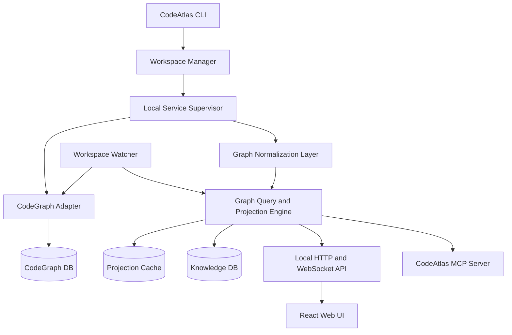

# CodeAtlas 产品与系统设计

- 状态：已确认，可进入 MVP 实施
- 日期：2026-08-04
- 目标读者：产品、设计、前端、后端、图算法与 AI 工程人员

## 1. 产品定义

CodeAtlas 是一个面向人和 AI 的本地代码知识空间。它把指定工作空间中的代码、项目结构和关系转换成统一图谱，让人能看懂、能探索、能验证、去积累这些知识，同时让 AI 使用同一份项目知识。

CodeAtlas 不只是 CodeGraph 的可视化外壳。CodeGraph 是第一阶段最重要的代码事实来源；CodeAtlas 在其上增加工作空间管理、统一图谱模型、全景与聚焦视图、来源验证、人工知识、可保存视角，以及面向 AI 的 MCP 查询能力。

### 1.1 核心原则

> 一个工作空间，一份完整底层图谱，多种关系图层和观察视图，用户决定从哪里切入。

1. 完整空间图是最终事实视图，不能因为复杂而被产品隐藏。
2. 大规模图使用全量数据、分级渲染、语义缩放和聚合层级；聚合是显示策略，不是数据裁剪。
3. 目录图、方法图、调用图等不是独立数据孤岛，而是统一图谱的查询投影。
4. 所有节点和关系必须说明来源；推断关系必须说明可信度。
5. 用户探索产生的视角、路径、说明和确认结果是项目知识的一部分。
6. 本地优先，第一版不依赖云端服务。

## 2. 目标用户与核心场景

### 2.1 目标用户

- 接手陌生代码库的开发者
- 维护中大型、多模块或多语言系统的团队
- 需要排查调用链和修改影响范围的开发者
- 需要理解代码库的技术负责人和架构师
- 使用 Codex、Claude Code、Cursor 等编码 Agent 的用户

### 2.2 核心任务

1. 初始化一个单项目或多项目工作空间。
2. 从完整空间图理解项目规模、边界、中心节点和耦合情况。
3. 从任意项目、目录、文件、类或方法节点切入。
4. 查看调用者、被调用者、继承、实现、依赖和包含关系。
5. 查找两个节点之间的最短路径或全部受限路径。
6. 查看关系来源，判断它是已验证、静态推导、启发式、AI 推断还是用户定义。
7. 将重要节点、链路、布局和说明保存为项目知识。
8. 让 AI 查询同一份空间图谱和已保存知识。

### 2.3 非目标

第一版明确不做：

- 自研多语言解析器以替代 CodeGraph
- 完整的跨语言变量级数据流分析
- 云端协作、账号、组织和权限系统
- 浏览器内代码编辑器或 IDE 替代品
- 运行生产代码或自动修改源文件
- 用 AI 推断冒充确定的代码事实

## 3. 产品范围与阶段

### 3.1 MVP

- `codeatlas init [path]`：初始化工作空间
- `codeatlas status`：展示索引和数据源状态
- `codeatlas sync`：主动同步
- `codeatlas open`：启动本地服务和 Web 界面
- 完整空间图
- 目录层级图
- 代码结构图和方法聚焦图
- 调用图、上下游展开、路径查找
- 搜索项目、文件和符号
- 节点详情、源码位置、关系来源和可信度
- 保存视角、路径与人工说明
- 单空间多项目识别
- CodeGraph 数据适配

### 3.2 后续阶段

**阶段 2：数据关系图**

- 数据库 Schema、ORM 实体、表、字段和外键
- OpenAPI、JSON Schema、GraphQL Schema
- API 到 DTO、实体和表的映射

**阶段 3：数据链路图**

- 参数、返回值、字段赋值和转换关系
- HTTP、RPC、事件、消息队列、缓存和数据库读写
- Source/Sink、污点传播和跨服务链路
- 运行时 Trace 对静态图谱的验证和增强

**阶段 4：团队知识空间**

- 知识分享、版本、评论和评审
- Git 提交/PR 对图谱和知识的影响
- 可选托管服务

## 4. 工作空间模型

### 4.1 初始化语义

```bash
codeatlas init
codeatlas init /path/to/workspace
```

未传路径时使用当前目录。传入路径时以该目录为工作空间根。一个工作空间可以包含一个或多个项目，项目由 Git 根目录、构建清单和语言特征自动识别，用户也可以在配置中覆盖。

```text
workspace/
├── .codegraph/
│   └── codegraph.db
├── .codeatlas/
│   ├── workspace.json
│   ├── knowledge.db
│   ├── cache/
│   └── layouts/
├── service-a/
└── service-b/
```

`workspace.json` 保存工作空间 ID、根目录、项目边界、数据源配置和排除规则。所有持久化路径以工作空间相对路径表达，避免移动目录后知识全部失效。

### 4.2 多项目规则

- 项目是工作空间中的一级逻辑边界，不要求每个项目独立建图。
- 跨项目 import、包依赖、HTTP、RPC、事件和共享数据库关系属于同一空间图。
- 节点稳定 ID 包含工作空间、项目、相对路径、符号限定名和符号类型。
- 项目移动或符号重命名时，通过内容指纹和 Git rename 信息尝试迁移人工知识；无法确定时保留为待重新绑定知识。

## 5. 统一图谱模型

### 5.1 节点

| 分类 | 节点类型 |
|---|---|
| 空间结构 | Workspace、Project、Module、Directory、File |
| 代码结构 | Class、Interface、Function、Method、Field、Variable、Type |
| 接口与流程 | Route、API、Event、Message、ExternalSystem |
| 数据模型 | Entity、DTO、Table、Column、Schema |
| 人工知识 | Knowledge、SavedView、BusinessDomain |

### 5.2 关系

| 关系 | 含义 |
|---|---|
| CONTAINS / DEFINES | 层级包含、符号定义 |
| IMPORTS / DEPENDS_ON | 导入与依赖 |
| CALLS / REFERENCES | 调用与引用 |
| EXTENDS / IMPLEMENTS | 继承与实现 |
| ROUTES_TO | 路由绑定入口 |
| READS / WRITES | 数据读写 |
| TRANSFORMS / MAPS_TO | 数据转换和映射 |
| PUBLISHES / SUBSCRIBES | 事件发布和订阅 |
| ANNOTATES / BELONGS_TO | 知识标注和业务归属 |

### 5.3 通用属性

```ts
type EvidenceClass =
  | 'verified'
  | 'static-derived'
  | 'heuristic'
  | 'ai-inferred'
  | 'user-defined';

interface GraphEntityMeta {
  id: string;
  workspaceId: string;
  projectId?: string;
  source: string;
  evidenceClass: EvidenceClass;
  confidence: number;        // 0..1
  sourceVersion?: string;
  sourceLocation?: string;
  createdAt: string;
  updatedAt: string;
}
```

`verified` 只用于编译器、数据库约束、运行时 Trace 或用户明确确认的关系。静态分析直接提取使用 `static-derived`；跨语言桥接、名称匹配等规则使用 `heuristic`。AI 生成关系永远使用 `ai-inferred`，除非用户确认后产生一条新的用户确认记录。

## 6. 图谱视图

### 6.1 完整空间图

完整空间图包含当前工作空间全部节点和关系，是最终事实视图。显示层使用语义缩放：

- 远景：项目、模块和高密度社区
- 中景：目录、文件、类型和重要入口
- 近景：方法、字段和具体关系

聚合节点必须显示其代表的节点数量、关系数量和类型构成。任何聚合都可以展开，任何隐藏都必须由用户筛选产生，并在界面显示当前过滤条件。

### 6.2 目录层级图

以 Workspace → Project → Module → Directory → File 为主，叠加跨目录依赖。适合识别层次、循环依赖和异常跨层访问。

### 6.3 代码结构图与方法图

以 File、Class、Interface、Function、Method 和 Field 为主，展示定义、包含、继承、实现和引用关系。方法图是围绕文件、类或方法的局部结构投影，不是独立索引。

### 6.4 调用图

展示 CALLS、ROUTES_TO、PUBLISHES、SUBSCRIBES 及接口到实现关系，支持：

- 上下游 N 层展开
- 两点最短路径
- 受最大深度和最大结果数约束的全部路径
- 循环调用识别
- 入口点和叶子节点标记
- 修改影响范围

### 6.5 数据关系图与数据链路图

数据关系图优先表达稳定结构，例如实体、表、字段、Schema 和映射。数据链路图表达运行过程中的读、写、转换和跨系统流转。二者共享统一图谱，但必须使用不同视图和证据说明。

## 7. 核心交互设计

```text
┌──────────────────────────────────────────────────────────────┐
│ 工作空间 / 全局搜索 / 当前视图 / 保存视角 / AI              │
├───────────────┬──────────────────────────────┬───────────────┤
│ 视图与图层    │                              │ 节点/关系详情 │
│ 全景图        │         图谱主画布           │ 源码位置      │
│ 目录图        │                              │ 来源与可信度  │
│ 代码结构图    │                              │ 上下游关系    │
│ 方法图        │                              │ 影响范围      │
│ 调用图        │                              │ 知识标注      │
│ 数据关系图    │                              │               │
│ 数据链路图    │                              │               │
├───────────────┴──────────────────────────────┴───────────────┤
│ 面包屑 / 图例 / 节点与边数量 / 过滤条件 / 索引状态          │
└──────────────────────────────────────────────────────────────┘
```

点击节点后可以高亮、展开、聚焦、隐藏、固定、查看源码、查找路径和保存知识。无关节点默认淡化而不是消失；进入“仅看相关节点”时必须明确显示聚焦状态，并提供一键返回完整空间。

关系详情必须显示：关系类型、起点、终点、来源、证据类别、可信度、生成时间和源码/Schema/Trace 证据。

### 7.1 保存视角

保存视角不是保存截图，而是保存可重放查询：

```json
{
  "name": "登录请求到用户表",
  "view": "call-graph",
  "rootNodeIds": ["..."],
  "relationTypes": ["CALLS", "ROUTES_TO"],
  "depth": 4,
  "filters": {},
  "pinnedNodeIds": ["..."],
  "camera": {},
  "note": "登录主链路"
}
```

图谱更新后重新执行查询，因此视角可以提示新增、删除和变更关系，而不会变成过期的静态图片。

## 8. 系统架构



### 8.1 CLI

负责初始化、配置、状态、同步、服务生命周期和诊断。CLI 不承担图查询业务，以保证 Web 与 MCP 使用同一套查询语义。

建议命令：

```text
codeatlas init [path]
codeatlas open [path] [--port]
codeatlas status [path]
codeatlas sync [path]
codeatlas doctor [path]
codeatlas uninit [path]
```

`uninit` 默认只删除 `.codeatlas/`，不删除 `.codegraph/`；任何删除前必须列出目标并要求确认。

### 8.2 Workspace Manager

负责根目录校验、项目识别、路径规范化、排除规则和数据源配置。所有访问必须限制在工作空间根目录中，防止通过符号链接或 `..` 读取空间外文件。

### 8.3 CodeGraph Adapter

第一阶段的数据源适配器。职责是：

- 检测和初始化 CodeGraph
- 查询版本、状态和索引健康度
- 将 CodeGraph 节点、边和文件转换成 CodeAtlas 类型
- 监听 Schema/版本兼容性
- 将 CodeGraph 的 provenance 映射到统一证据类别

适配器之后可以增加 `DatabaseSchemaAdapter`、`OpenAPIAdapter`、`RuntimeTraceAdapter` 和 `GitAdapter`。

### 8.4 Graph Query and Projection Engine

核心能力：

- 节点与关系搜索
- 子图查询和 N 层展开
- 最短路径、受限全部路径和影响范围
- 社区检测和分层聚合
- 针对不同视图的投影
- 证据与可信度合并
- 保存视角重放
- 结果预算和分页

查询必须返回 `totalMatched`、`returned`、`truncated` 和截断原因，禁止静默丢弃节点。

### 8.5 Web UI

建议 React + TypeScript。图形层使用 Graphology 作为内存图模型、Sigma.js/WebGL 负责大图渲染；层级布局使用 Web Worker 中的 ELK，力导向布局使用 ForceAtlas2。所有布局计算不得阻塞 UI 主线程。

### 8.6 MCP

MCP 与 Web 共用查询引擎，第一版暴露少量高价值工具：

```text
codeatlas_explore
codeatlas_path
codeatlas_view
codeatlas_knowledge
codeatlas_status
```

MCP 返回节点和关系时必须包含来源、证据类别和工作空间相对位置。默认只读；创建知识需要显式调用写工具。

## 9. 本地 API 草案

```text
GET  /api/workspace
GET  /api/status
GET  /api/search?q=
POST /api/graph/project
POST /api/graph/neighborhood
POST /api/graph/path
GET  /api/nodes/:id
GET  /api/edges/:id
GET  /api/views
POST /api/views
PUT  /api/views/:id
GET  /api/knowledge
POST /api/knowledge
GET  /api/events                 WebSocket/SSE upgrade
```

图查询请求必须包含节点/边预算。响应包含图谱版本，前端收到版本变化事件后将当前视角标记为可能变化，并允许用户刷新投影。

## 10. 存储设计

### 10.1 MVP 选择

- CodeGraph DB：代码事实来源，只通过 Adapter 访问
- `knowledge.db`：SQLite，存储工作空间元数据、人工知识、保存视角、稳定 ID 映射和来源状态
- Projection Cache：本地可删除缓存，不承担事实持久化
- Layout：小型布局写入 SQLite；大型坐标快照存入 `.codeatlas/cache/`

第一版不引入 Neo4j。工作空间是单机、单用户、本地读多写少场景，SQLite 的部署、备份和迁移成本远低于图数据库。图遍历由内存邻接索引和受预算查询完成；当单空间规模或并发需求证明 SQLite 不足时再评估图数据库。

### 10.2 知识数据

```text
knowledge
saved_views
view_revisions
entity_bindings
source_registry
workspace_projects
schema_migrations
```

人工知识不直接修改 CodeGraph 事实，而是以覆盖、确认、否定或注释记录存在。这样重新索引不会丢失用户知识，也不会篡改来源事实。

## 11. 全量图与大规模渲染

### 11.1 产品承诺

完整空间图代表全部已索引节点和关系。系统不能为了性能在用户不知情的情况下删减结果。

### 11.2 显示策略

- 10 万节点以内：WebGL 点和边全量加载，按缩放级别控制标签和边细节。
- 10 万至 100 万节点：加载全量节点轻量属性；关系按类型和视口分块，远景显示聚合边。
- 超过 100 万节点：服务端生成可展开的多层聚合图；状态栏始终显示底层总量和当前显示量。
- 搜索、筛选和聚焦是显式用户行为，必须可以撤销。
- 所有聚合节点都能下钻；聚合结果必须可复现并记录算法版本。

这满足“完整图是最终结果”，同时避免浏览器为一次展示所有标签和边几何而失去交互能力。

## 12. 非功能需求

### 12.1 性能目标

| 场景 | MVP 目标 |
|---|---|
| CLI 冷启动 | p95 < 1 秒，不含首次索引 |
| 本地 UI 首屏 | p95 < 2 秒 |
| 符号搜索 | 10 万节点 p95 < 100ms |
| 一层邻域查询 | 10 万节点 p95 < 150ms |
| 受限最短路径 | 100 万边 p95 < 500ms |
| 普通交互帧率 | 30 FPS 以上，目标 60 FPS |
| 文件变更可见 | CodeGraph 同步完成后 2 秒内通知 UI |

### 12.2 规模目标

- MVP 验证：10 万节点、50 万关系
- 第一版工程目标：100 万节点、500 万关系
- 单机单活，不承诺多用户并发

### 12.3 可靠性

- 代码事实可通过重新索引恢复。
- 人工知识采用事务写入和每日/退出时滚动备份，目标 RPO 5 分钟、RTO 30 分钟。
- 数据库迁移必须可回滚或在迁移前生成备份。
- 服务异常退出不能破坏 CodeGraph DB 或 knowledge DB。

### 12.4 可维护性

- Adapter、Query Engine、API 和 UI 使用明确边界。
- 数据源和图类型可插件式扩展。
- Schema、聚合算法和布局算法均记录版本。
- 支持 `codeatlas doctor` 输出可脱敏诊断报告。

## 13. 安全与隐私

1. 服务默认只绑定 `127.0.0.1`/`::1`，禁止默认监听局域网。
2. 启动时生成会话令牌，浏览器 API 和 WebSocket 均需验证。
3. 使用严格 CSP，源码内容按纯文本渲染，避免代码中的 HTML/脚本造成 XSS。
4. 文件读取必须通过规范化后的工作空间相对路径，并阻止符号链接越界。
5. Adapter 不拼接执行来自源码或用户输入的 Shell 命令。
6. MCP 默认只读；知识写入工具单独标记，源码修改不属于第一版能力。
7. 默认不收集遥测，不上传源码、路径、符号、搜索词或人工知识。
8. 若未来引入 AI 云服务，必须按单次操作明确提示发送范围，并提供完全本地模式。

## 14. 故障模式与恢复

| 故障 | 用户影响 | 处理方式 |
|---|---|---|
| 未安装 CodeGraph | 无法生成代码事实 | `doctor` 给出安装指引，禁止生成伪图 |
| CodeGraph 索引失败 | 图谱不完整 | 显示失败文件、错误数和最后成功版本 |
| CodeGraph Schema 变化 | Adapter 无法读取 | 进入兼容性错误状态，不猜测字段含义 |
| 索引落后于文件 | 源码位置可能过期 | 显示 stale 标记，触发同步，禁止把旧切片标为已验证 |
| knowledge DB 损坏 | 保存知识不可用 | 只读启动、从滚动备份恢复，代码图仍可查看 |
| 图过大导致内存不足 | UI 卡顿或崩溃 | 降级到服务端聚合和按块加载，显示降级原因 |
| 布局任务失败 | 节点无坐标 | 回退到确定性网格/圆形布局，不影响查询 |
| 端口占用 | Web 无法启动 | 自动选择空闲回环端口并打印地址 |
| 工作空间被移动 | 绑定失效 | 用相对路径和内容指纹重新绑定 |
| 文件监视器丢事件 | 图谱过期 | 周期轻量校验与手动 `sync` |

## 15. 测试策略

### 15.1 单元测试

- 稳定 ID 与路径规范化
- CodeGraph 类型映射
- 证据类别与可信度规则
- 图投影、预算、截断标记
- BFS/双向 BFS、循环检测和影响范围
- 保存视角序列化与重放
- 工作空间越界和符号链接防护

### 15.2 集成测试

- 在固定多语言样例仓库上执行 init → index → query → open
- CodeGraph 升级兼容性契约测试
- 文件新增、修改、删除后的增量更新
- 多项目跨项目调用和依赖
- knowledge DB 迁移、备份和恢复
- MCP 与 Web API 查询结果一致性

### 15.3 可视化测试

- 1k、10k、100k 和 1M 节点合成图性能基准
- 截图回归：图例、来源样式、聚合、聚焦和返回全景
- 布局确定性与重复打开视角一致性
- 键盘操作、颜色对比度和非颜色证据标识

### 15.4 验收场景

1. 在一个含多个项目的工作空间运行 `init`，UI 显示全部项目和总节点/边数量。
2. 用户从完整图选择一个方法，三次操作内看到其上下游调用和源码位置。
3. 用户选择两个方法，能得到路径或明确的“在当前关系/深度限制下无路径”。
4. 用户能识别一条关系来自静态分析还是启发式规则，并打开证据。
5. 用户保存一个调用视角，重启后可恢复；代码变化后能提示视角发生变化。
6. 未经过用户筛选时，系统不得静默隐藏索引中的节点数量。

## 16. 可观测性与诊断

本地结构化日志记录命令、阶段、耗时、数量和错误码，不记录源码、完整路径、符号名或搜索内容。`codeatlas doctor` 输出：

- CodeAtlas/CodeGraph/Node/OS 版本
- 工作空间可访问性
- DB Schema 与健康状态
- 节点、边、失败文件和过期文件数量
- 监听器、端口和内存状态
- 可选脱敏日志包

## 17. 技术建议

| 领域 | 建议 | 理由 |
|---|---|---|
| CLI/本地服务 | TypeScript + Node 22 | 与 CodeGraph SDK 生态一致，开发速度快 |
| HTTP | Fastify 或轻量 Node HTTP 层 | 本地 API、Schema 校验、WebSocket 支持 |
| UI | React + TypeScript + Vite | 组件生态与开发效率 |
| 图数据结构 | Graphology | 与 Sigma.js 配套，算法和序列化成熟 |
| 大图渲染 | Sigma.js/WebGL | 适合大规模关系网络和自定义节点/边 |
| 层级布局 | ELK.js in Web Worker | 目录、调用链和数据流布局能力强 |
| 力导向布局 | ForceAtlas2 in Web Worker | 全景和社区结构可读性 |
| 本地存储 | SQLite | 零部署、事务、备份简单 |
| Schema 校验 | Zod/JSON Schema | CLI、API、配置和 Adapter 契约统一 |
| 测试 | Vitest + Playwright | 单元、集成与视觉交互测试 |

具体库在实现前以性能 Spike 验证，不将技术建议视为不可变约束。

## 18. 实施路线

### 里程碑 0：技术验证（1–2 周）

- 读取一个 CodeGraph 索引并完成类型映射
- 在 WebGL 中展示 10 万节点/50 万关系
- 验证邻域、路径和聚合查询
- 确认 CodeGraph 集成使用公开 API还是兼容层

退出条件：验证性能、数据完整性和集成可行性。

### 里程碑 1：工作空间与基础图（2–3 周）

- CLI、workspace.json、init/status/sync/open
- 本地服务、搜索、完整空间和目录视图
- 数据源状态与错误展示

### 里程碑 2：代码探索（3–4 周）

- 代码结构、方法与调用视图
- 上下游展开、路径查找、源码定位
- 来源、证据和可信度 UI

### 里程碑 3：知识积累与 MCP（2–3 周）

- 保存视角、说明、绑定和变更提示
- MCP 只读探索和显式知识写入
- 备份、恢复、doctor 和安装体验

### 里程碑 4：稳定化（2 周）

- 大图性能、兼容性、安全、可访问性
- 多项目验收仓库和端到端测试
- 打包 macOS、Windows、Linux

小团队 MVP 预估 10–14 周。单人应先完成里程碑 0，再根据结果重新估算，不承诺一次性交付所有阶段。

## 19. 成功指标

- 用户初始化真实仓库后 5 分钟内完成第一次有效探索。
- 从搜索到看到目标方法上下游不超过 3 次主要操作。
- 90% 的图查询明确报告完整、截断或聚合状态。
- 用户能在测试中正确区分确定关系与推断关系。
- 在基准仓库上，保存视角重放结果稳定，索引变化可被检测。
- 至少 5 个真实中大型仓库验证“完整空间 → 节点切入 → 调用探索 → 保存知识”的闭环。

## 20. 开放问题

这些问题不阻塞技术验证，但必须在对应里程碑前决定：

- CodeGraph 集成优先使用 SDK、CLI JSON 还是受控只读 DB 兼容层
- 社区检测算法及聚合层级的稳定性策略
- 源码展示是否跳转外部编辑器，首批支持哪些 URI Scheme
- 人工知识在 Git 中共享时采用 SQLite 导出还是可合并文本格式
- 数据链路阶段采用静态 SSA、规则引擎、运行时 Trace，还是混合方案

## 21. 架构决策

关键决策见：

- [ADR-0001：采用本地优先的 CLI + Web 架构](../adr/0001-local-first-cli-web.md)
- [ADR-0002：统一底层图谱与多视图投影](../adr/0002-unified-graph-projections.md)
- [ADR-0003：通过适配器集成 CodeGraph](../adr/0003-codegraph-adapter.md)
- [ADR-0004：MVP 使用 SQLite 而非独立图数据库](../adr/0004-sqlite-over-graph-database.md)
- [ADR-0005：完整图采用 WebGL 与分级渲染](../adr/0005-full-graph-progressive-rendering.md)
